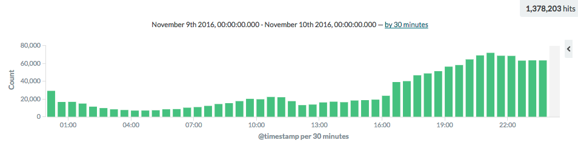
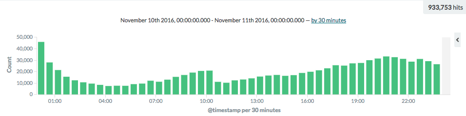

# Leveraging HTTP caching with Cloudflare

> There are only two hard things in Computer Science: cache invalidation and naming things. (c) Phil Karlton

Fetching something over the network is both slow and expensive. Large responses require many round trips between the client and server, which delays when they are available and when the browser can process them and incurs data costs for the visitor and the infrastructure. Thus, the ability to cache and reuse previously fetched resources is a critical aspect of optimising for performance.

Up until recently we at [XCaliber](https://www.xcaliber.com/) weren't taking advantage of HTTP caching for our API resources, and considering we have millions of requests per day, we weren't being as efficient as we could have been.

We did have (and still have) client caching, but we are using [localStorage](https://developer.mozilla.org/en/docs/Web/API/Window/localStorage) to accomplish it. While this works fine, it has limitations like the amount of data that you can store in the client. Also, it doesn't allow us to take advantage of our reverse proxy caching capabilities.

So, we went on a mission to change all that, and today we have appropriate HTTP caching set up on our APIs, which [Cloudflare](https://www.cloudflare.com/) is helping us serve, effectively lowering our data and server costs, whilst also giving our customers a better experience by having this data delivered from their nearest data centre.

After all the API and infrastructure changes and configurations, we are quite happy with the end-result. Although, we are not going to stop here. (:

__Before__

__After__

__Notes__
* Both charts represent a 24h period before and after the changes were introduced during slower week days.
* They represent the number of API hits for one specific resource, and for one specific brand.
* On this specific resource, for this specific brand we were able to save 30% of the requests, and we expect further savings during busy days.
* This also means that we are saving on data costs as well, because 30% of the requests are now being served via Cloudflare.
